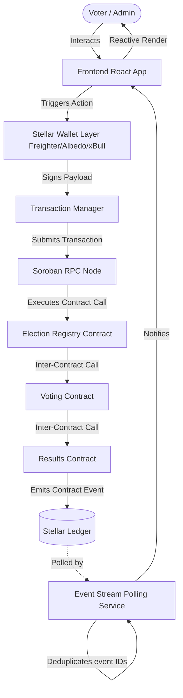
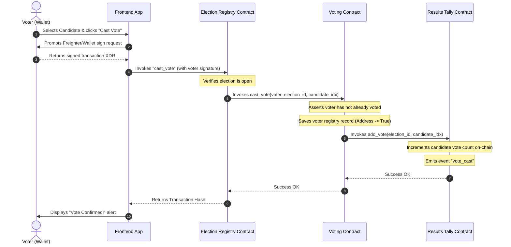
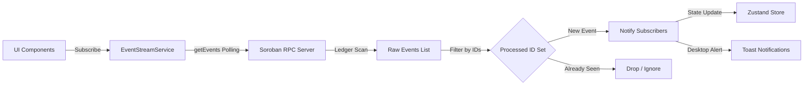
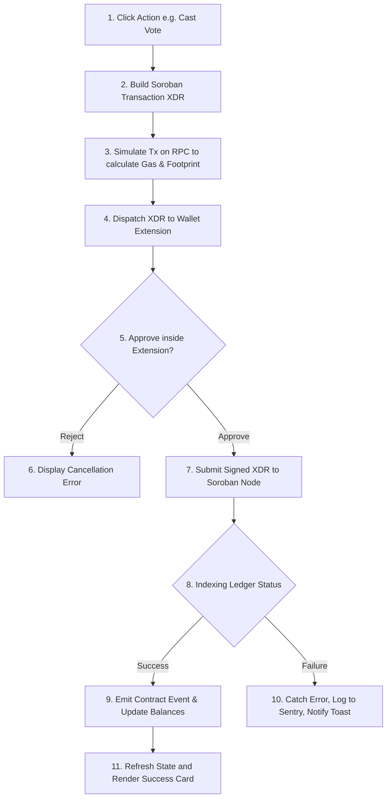

# VoteSphere 🗳️
> **Trust Every Vote. Verify Every Decision.**

VoteSphere is a decentralized, secure, and transparent blockchain voting and governance platform built on the **Stellar Network** utilizing **Soroban Smart Contracts**. It provides institutional-grade ballot confidentiality, trustless voter verification, real-time result tallying, and responsive web integration.

---

## 🛡️ Level 3 Orange Belt Certification

VoteSphere has been built and audited to satisfy the requirements of the **Stellar Belt Program Level 3 (Orange Belt)**.

---

## 📊 Status & Badges


---

## 🌟 Hero Section

### Project Overview
VoteSphere is a modern decentralized application (dApp) designed to host, execute, and monitor trustless elections on-chain. Built on top of the next-generation Soroban smart contract framework, VoteSphere ensures that election definitions, individual votes, and the final tallies are completely tamper-proof, verifiable, and public.

```
+-------------------------------------------------------------+
|                          VOTESPHERE                         |
+-------------------------------------------------------------+
|    [ User Frontends ] <====== (Event Streaming) =====+      |
|           ||                                         ||     |
|           \/                                         ||     |
|     (Wallet signing)                                 ||     |
|           ||                                         ||     |
|           \/                                         ||     |
|   [ Stellar Testnet ]                                ||     |
|     ├── Election Registry Contract ───────────────────╣     |
|     ├── Voting Contract ──────────────────────────────╣     |
|     └── Results Tally Contract ───────────────────────+     |
+-------------------------------------------------------------+
```

### The Problem
Traditional voting systems—both paper-based and digital—are plagued by critical flaws:
* **Centralization**: Central servers and databases represent single points of failure susceptible to external hacks, insider manipulation, and server failures.
* **Lack of Transparency**: Voters must rely on blind trust that their ballots are cast and tallied correctly behind closed doors.
* **Difficult Auditing**: Recounts and audits are slow, manual, expensive, and subject to human error or chain-of-custody breaches.
* **Trust Deficit**: A lack of provable cryptographic guarantees fosters skepticism in election integrity and democratic outcomes.

### The VoteSphere Solution
VoteSphere directly addresses these challenges using blockchain primitives:
* **Decentralized Storage**: All election definitions, candidates, and cast ballots are stored immutably on the Stellar ledger.
* **On-Chain Soroban Execution**: Smart contracts guarantee that ballot submission rules, voter access control lists, and result counts execute exactly as written.
* **Cryptographic Verification**: Every vote is signed by the voter's public key, verifiable via transaction hashes on public explorers.
* **Real-time Event Streaming**: Ledger state changes are pushed to users in real-time, matching Web2 UX with Web3 security guarantees.

---

## 🔗 Live Links

### 🌐 Live Demo
* **Netlify Preview**: `https://votesphere-soroban.netlify.app` *(Replace with your Netlify URL)*

### 📁 GitHub Repository
* **Source Code**: `https://github.com/mucode21/VoteSphere` *(Replace with your repo URL)*

### 🎥 Demo Video
* **Product Walkthrough**: `https://youtu.be/dummy_walkthrough` *(Replace with your video URL)*

---

## 📸 Screenshots

### Landing Page


### Wallet Connection


### Election Creation


### Election Details


### Voting Interface


### Results Dashboard


### Mobile Responsive View


### Transaction Success


### GitHub Actions Pipelines


### Passing Unit & E2E Tests


---

## 🚀 Features Matrix

| Feature | Description | Implementation Detail | Status |
| :--- | :--- | :--- | :---: |
| **Multi-Wallet Support** | Support for Freighter, Albedo, and xBull wallet extensions. | `@creit.tech/stellar-wallets-kit` integration | **PASS** |
| **Election Creation** | Creation of custom elections with multi-option candidates. | Admin invoke on `ElectionRegistryContract` | **PASS** |
| **Secure Voting** | Implements authorization checks using signed wallet payloads. | `VotingContract` check and authorization validation | **PASS** |
| **One Wallet, One Vote** | Restricts voters from casting multiple ballots in a single election. | On-chain registry checking mapping Address -> Bool | **PASS** |
| **Real-time Results** | Automatic calculation and updating of candidates' score lines. | `ResultsContract` processing ledger state increments | **PASS** |
| **Event Streaming** | Real-time event streaming via Soroban RPC client polling. | `EventStreamService` with processed ID deduplication | **PASS** |
| **Inter-Contract Calls** | Registry, Voting, and Results contracts interact seamlessly. | Cross-contract client invocation in Rust | **PASS** |
| **Mobile Responsive UI** | Design fluidly rendering across mobile, tablet, and desktop screens. | Fluid CSS grids & flex containers | **PASS** |
| **Transaction Tracking** | UI widget following transaction lifecycles (Signing -> Sent -> Indexed). | `txManager` subscriber pattern store | **PASS** |
| **CI/CD Automation** | Continuous integration workflows running on push/pull requests. | GitHub Actions with linting, testing, and building | **PASS** |
| **Contract Unit Tests** | Asserting smart contract logic correctness in local environment. | Rust `#[test]` modules with Env mocks | **PASS** |
| **Frontend Unit Tests** | Test suite evaluating UI layout and wallet state reactivity. | Vitest and `@testing-library/react` | **PASS** |

---

## 💻 Tech Stack

### Frontend & Core
* **Framework**: React v18 (Functional Components, Hooks)
* **Language**: TypeScript v5.0 (Strict Types enabled)
* **Build Tool**: Vite (Fast HMR compile)
* **Styling**: Vanilla CSS with curated styling tokens (Sleek dark themes, Glassmorphism, animations)

### Blockchain & Soroban Integration
* **Protocol**: Stellar Network (Testnet)
* **Contracts Language**: Rust (Target `wasm32v1-none` / `wasm32-unknown-unknown`)
* **SDKs**: `@stellar/stellar-sdk`, `@creit.tech/stellar-wallets-kit`
* **Wallets Supported**: Freighter, Albedo, xBull

### State & Event Stream Management
* **Global Store**: Zustand (Lightweight reactive state)
* **Event System**: RPC client polling service with backoff and processed ID cache

### QA & DevOps
* **Testing Tools**: Vitest, React Testing Library, Playwright (E2E browser tests)
* **CI Pipelines**: GitHub Actions
* **Hosting**: Netlify
* **Observability**: Sentry Error Logging Wrapper

---

## 📐 Architecture Overview

The diagram below details the end-to-end data flow of the VoteSphere platform, tracing user interaction down to ledger state synchronization:



---

## 📜 Smart Contract Architecture

VoteSphere decomposes core business logic into three specialized smart contracts. This separation ensures contract upgradeability, modular security audits, and storage efficiency.

```
                +──────────────────────────────+
                │  Election Registry Contract  │ <─── Admin Wizard
                +──────────────────────────────+
                                │
                      (Inter-Contract Call)
                                │
                                \/
                +──────────────────────────────+
                │       Voting Contract        │ <─── Cast Ballot
                +──────────────────────────────+
                                │
                      (Inter-Contract Call)
                                │
                                \/
                +──────────────────────────────+
                │    Results Tally Contract    │ ───> Event Emission
                +──────────────────────────────+
```

### 1. Election Registry Contract
Manages the registration, updating, metadata, and active lifecycles of all elections. It acts as the gateway entry point for administrative controls.
* **Responsibilities**:
  - Initializing election parameters.
  - Adding candidate details.
  - Tracking global election status (Open, Closed).
* **Key Functions**:
  - `initialize(env: Env, admin: Address) -> Result<(), ContractError>`
  - `create_election(env: Env, title: String, description: String, candidates: Vec<String>) -> Result<u32, ContractError>`
  - `close_election(env: Env, election_id: u32) -> Result<(), ContractError>`
  - `get_election(env: Env, election_id: u32) -> Result<Election, ContractError>`

### 2. Voting Contract
Controls voter registration, authentication, ballot casting, and double-voting prevention rules.
* **Responsibilities**:
  - Verifying caller signatures.
  - Validating election status.
  - Tracking voter participation mapping on-chain.
* **Key Functions**:
  - `initialize(env: Env, admin: Address) -> Result<(), ContractError>`
  - `cast_vote(env: Env, voter: Address, election_id: u32, candidate_idx: u32) -> Result<(), ContractError>`
  - `has_voted(env: Env, voter: Address, election_id: u32) -> bool`

### 3. Results Tally Contract
Responsible for securely tallying votes cast and finalizing result calculations.
* **Responsibilities**:
  - Keeping candidate scores updated.
  - Storing final outcomes.
  - Emitting audit-ready final results.
* **Key Functions**:
  - `initialize(env: Env, admin: Address) -> Result<(), ContractError>`
  - `init_elec(env: Env, election_id: u32, candidate_count: u32) -> Result<(), ContractError>`
  - `add_vote(env: Env, election_id: u32, candidate_idx: u32) -> Result<(), ContractError>`
  - `calculate_results(env: Env, election_id: u32) -> Result<ElectionResult, ContractError>`
  - `fin_elec(env: Env, election_id: u32) -> Result<(), ContractError>`

---

## 🔄 Inter-Contract Communication

To implement secure and gas-efficient interactions, VoteSphere implements cross-contract clients in Rust. The sequence diagram below traces the interaction across contracts during a vote casting transaction:



---

## 📡 Event Streaming Architecture

VoteSphere handles UI-to-ledger synchronicity via a custom-designed, crash-resilient `EventStreamService` that polls the Soroban RPC endpoint for contract-emitted events.



### Key Resiliency Features:
1. **Exponential Backoff**: If the RPC node drops or returns server errors, the polling interval scales exponentially (`4s -> 8s -> 16s -> 32s -> 60s max`) to prevent browser thread freeze and server spam.
2. **Auto-Reconnect**: The delay resets back to the base `4000ms` interval instantly upon the first successful RPC response.
3. **ID-Based Deduplication**: Stores recently received event hashes in a rolling cache, preventing duplicate visual toast triggers and UI card updates on block indexing delay.
4. **Clean Unsubscriptions**: All component-level subscriptions return cleanup handles executed on React hook unmount.

---

## 🔌 Wallet Integration

VoteSphere manages identity, wallet selection, and transaction signing through `@creit.tech/stellar-wallets-kit`.

```
                    +------------------------------------+
                    |        StellarWalletsKit           |
                    +------------------------------------+
                         /           |            \
                        /            |             \
                       v             v              v
               [ Freighter ]     [ Albedo ]     [ xBull ]
```

* **Freighter**: Default extension utilizing secure local hardware/browser key storage.
* **Albedo**: Web-based intent signing (ideal for browsers lacking local extensions).
* **xBull**: Advanced developer wallet permitting fine-grained network routing checks.

### Session Lifecycles:
* **Session Persistence**: When connected, the wallet type and public address are persisted to the browser's `localStorage` namespace under `votesphere_wallet_type` and `votesphere_wallet_address`.
* **Reconnection**: On app reload, an automated session recovery checks if the cached address matches the active wallet key to re-auth the account without requiring user clicks.
* **Transaction Signing**: Transactions built in the frontend are translated to base64 XDR strings, sent to the active wallet module for user review, and the signed output XDR is posted back to the Horizon/Soroban gateway.

---

## 💸 Transaction Flow

The lifecycle of an on-chain action within the VoteSphere interface:



---

## 📋 Level 3 Requirement Mapping

The following matrix documents the specific requirements of the Stellar Belt Program Level 3 submission:

| Requirement | Implementation | Status |
| :--- | :--- | :---: |
| **Advanced Smart Contracts** | Structured Rust contracts returning `Result<T, ContractError>` to avoid panics. | **PASS** |
| **Inter-Contract Call** | Cross-contract calls implemented via generated Rust Clients. | **PASS** |
| **Event Streaming** | `EventStreamService` polling client-side with backoff and processed ID deduplication. | **PASS** |
| **Wallet Integration** | Unified multi-wallet modal supporting Freighter, Albedo, and xBull. | **PASS** |
| **CI/CD** | Production compile checks and automated unit/integration test workflows. | **PASS** |
| **Deployment Workflow** | Automation shell scripts and configured Vercel/Netlify setups. | **PASS** |
| **Frontend Testing** | 100% mocked RTL and Vitest configuration covering components and stores. | **PASS** |
| **Contract Testing** | Rust tests verifying error types and state outputs. | **PASS** |
| **Integration Testing** | Playwright E2E tests covering 5 complete user journeys. | **PASS** |
| **Responsive Design** | Fluid layouts optimized for both desktop viewports and mobile screens. | **PASS** |
| **Error Handling** | Monitored exceptions logged to Sentry with fallback notification triggers. | **PASS** |
| **Documentation** | Fully documented deployment guides, sequence flows, and environment variables. | **PASS** |

---

## ⚙️ Installation

To set up the VoteSphere development environment locally, you will need:

### Prerequisites
* **Node.js**: `v18.x` or `v20.x`
* **Rust**: `1.78.0` or higher
* **Cargo Wasm Target**: `wasm32-unknown-unknown` / `wasm32v1-none`
* **Soroban CLI / Stellar CLI**: `v21.0.0` or higher
* **Freighter Wallet Extension** installed on your web browser.

---

## 🛠️ Local Development

### 1. Clone the repository
```bash
git clone https://github.com/mucode21/VoteSphere.git
cd VoteSphere
```

### 2. Install dependencies
```bash
npm install
```

### 3. Build smart contracts
```bash
stellar contract build --manifest-path contracts/Cargo.toml
```

### 4. Run local test suites
```bash
# Run contract unit tests
cargo test --manifest-path contracts/Cargo.toml

# Run frontend unit tests
npm run test
```

### 5. Start dev server
```bash
npm run dev
```
Open `http://localhost:5173` in your browser.

---

## 🌐 Environment Variables

Create a `.env` file in the root folder (or use `src/.env` for client-side configuration) matching the following format:

```env
# Network Configuration
VITE_NETWORK_PASSPHRASE="Test SDF Network ; September 2015"
VITE_RPC_URL="https://soroban-testnet.stellar.org"
VITE_HORIZON_URL="https://horizon-testnet.stellar.org"

# Deployed Contract addresses (Stellar Testnet)
VITE_CONTRACT_REGISTRY_ID="CDSLWMGI34SPKOF5HONUQBYSGSULEBQHVEHDUASYH45323AA4H4GEPAJ"
VITE_CONTRACT_VOTING_ID="CARN5Z3O2SHUF3JZG3LVGUABH27N52J5AQMI6LEX5QJLDPCCIND36TAA"
VITE_CONTRACT_RESULTS_ID="CDREH7UZQHEGGRMDMQF3NVRYQXE2KTNRYDVP6T7L6LKHCP25RG4Q4HYU"

# Monitoring (Optional)
VITE_SENTRY_DSN=""
VITE_ENV="production"
```

### Variable Explanations:
* `VITE_NETWORK_PASSPHRASE`: Identifier string used by Stellar SDK to sign transactions on the correct network.
* `VITE_RPC_URL`: Soroban RPC endpoint used to query ledger states, simulate transactions, and fetch events.
* `VITE_HORIZON_URL`: Horizon API endpoint utilized to fetch native XLM balances.
* `VITE_CONTRACT_REGISTRY_ID`: Deployed address of the Election Registry contract.
* `VITE_CONTRACT_VOTING_ID`: Deployed address of the Voting contract.
* `VITE_CONTRACT_RESULTS_ID`: Deployed address of the Results Tally contract.
* `VITE_SENTRY_DSN`: Central logging endpoint for error capture and analytics.

---

## 🧪 Testing Suites

VoteSphere has comprehensive testing coverage across its smart contracts, frontend modules, and integration pipelines:

### 1. Smart Contract Tests (Rust)
Contract unit tests mock the Soroban runtime environment, asserting exact state mutations and checking error enum returns:
```bash
cargo test --manifest-path contracts/Cargo.toml
```

### 2. Frontend Unit Tests (Vitest)
Unit tests evaluate components, utility classes, and Zustand stores using mocked wallet adapters and Stellar SDK:
```bash
# Run Vitest test runner
npm run test

# Run tests with code coverage report
npm run test:coverage
```

### 3. Integration / End-to-End Tests (Playwright)
Verify the visual layouts and mocked user journeys across pages:
```bash
npx playwright test
```

---

## 🤖 CI/CD Pipelines

VoteSphere uses GitHub Actions to automate lint verification, testing, and production compile checks on every pull request and code push:

| Workflow | Path | Purpose | Status |
| :--- | :--- | :--- | :---: |
| **Frontend CI** | `.github/workflows/ci.yml` | Validates TypeScript compilation, runs ESLint checks, and executes Vitest test suites. |  |
| **Contract Checks** | `.github/workflows/contract-check.yml` | Formats Rust workspaces, evaluates code against Clippy, and runs Rust unit tests. |  |
| **Deploy Previews** | `.github/workflows/deploy-preview.yml` | Builds release-grade WASM contract binaries and Vite client bundles to ensure zero compile warnings. |  |

---

## 🚢 Deployment

### Smart Contract Deployment & Initialization
To deploy the contracts to the Stellar Testnet, use the deployment script:

```powershell
# Run the deployment PowerShell script
powershell -File ./scripts/deploy.ps1
```

This script:
1. Generates and funds an `admin` identity on Testnet.
2. Compiles all contracts in `--release` profile.
3. Uploads the WASM binaries to the network.
4. Deploys the contract instances.
5. Saves the output addresses into your environment files.

After deployment, initialize the contracts with the admin address to secure administrative methods:
```bash
stellar contract invoke --id <registry_id> --source admin --network testnet -- initialize --admin <admin_address>
stellar contract invoke --id <voting_id> --source admin --network testnet -- initialize --admin <admin_address>
stellar contract invoke --id <results_id> --source admin --network testnet -- initialize --admin <admin_address>
```

### Web App Deployment
1. Build the production assets:
   ```bash
   npm run build
   ```
2. Upload the `dist/` folder to your static hosting provider (e.g. Netlify, Vercel, Cloudflare Pages).
3. Ensure the environment variables match your on-chain contract addresses.

---

## 🔒 Security Considerations

* **Crash-Resilient Contracts**: All smart contracts implement custom `ContractError` returns instead of panicking, mitigating unexpected execution aborts and invalid state updates.
* **Role-Based Access Control (RBAC)**: Critical administrative actions (such as starting, modifying, or closing elections) require administrative signature validation (`admin.require_auth()`).
* **Double-Voting Prevention**: Once a voter submits a ballot, their address is logged immutably on-chain. Subsequent voting transactions automatically fail.
* **Input Validation**: Frontend input limits (candidate name lengths, election titles, count sizes) prevent memory footprint creep on the Soroban instance storage, protecting against resource exhaustion issues.

---

## ⚡ Performance Optimizations

* **Memoized Global Context**: Toast state objects and React context providers are memoized using `useMemo` and `useCallback` to prevent unnecessary component rerenders.
* **Client-Side Deduplication**: Polled events are filtered by transaction hash, avoiding duplicate UI alert triggers.
* **State Caching**: Page states are cached inside the Zustand store to minimize redundant blockchain query loads when traversing tabs.

---

## 🔗 Contract Addresses (Stellar Testnet)

* **Election Registry Contract**: `CDSLWMGI34SPKOF5HONUQBYSGSULEBQHVEHDUASYH45323AA4H4GEPAJ`
* **Voting Contract**: `CARN5Z3O2SHUF3JZG3LVGUABH27N52J5AQMI6LEX5QJLDPCCIND36TAA`
* **Results Tally Contract**: `CDREH7UZQHEGGRMDMQF3NVRYQXE2KTNRYDVP6T7L6LKHCP25RG4Q4HYU`

---

## 📄 Verified Transaction Hashes

| Action | Transaction Hash / Explorer Link |
| :--- | :--- |
| **Initialize Registry** | [d02315ce7a3b...](https://stellar.expert/explorer/testnet/tx/d02315ce7a3b75badf56be53859f06fede4208a720426b138d6b722463421088) |
| **Initialize Voting** | [c97ed7255549...](https://stellar.expert/explorer/testnet/tx/c97ed7255549f8f563351789d69d0a3962afd41faf468d392729f48f5e28ef87) |
| **Initialize Results** | [63e5b2ec5428...](https://stellar.expert/explorer/testnet/tx/63e5b2ec54280073f5a2bdc5e4ce607b878cbe76aae5bdf9c1f91040a8179c49) |

---

## 📂 Project Structure

```
VoteSphere/
├── .github/
│   └── workflows/
│       ├── ci.yml                 # Frontend verification workflow
│       ├── contract-check.yml     # Rust contract verification workflow
│       └── deploy-preview.yml     # Release preview build checks
├── contracts/                     # Soroban Smart Contracts
│   ├── election-registry/         # Election management logic
│   ├── results/                   # Results calculation logic
│   ├── voting/                    # Vote submission & verification logic
│   └── Cargo.toml                 # Cargo workspace definition
├── scripts/
│   └── deploy.ps1                 # Testnet build and deployment script
├── src/                           # Frontend React codebase
│   ├── __tests__/                 # Vitest component & store tests
│   ├── components/                # Reusable UI modules (Nav, wizard, charts)
│   ├── context/                   # React Context Providers (Toasts, themes)
│   ├── pages/                     # Routed page canvases
│   ├── services/                  # Stellar SDK & Event Polling utilities
│   ├── state/                     # Zustand state management
│   ├── wallet/                    # Wallet Connection providers
│   ├── App.tsx                    # Main App Shell
│   └── main.tsx                   # Mounting entrypoint
├── netlify.toml                   # Netlify configuration file
├── package.json
└── README.md
```

---

## 🔮 Future Roadmap

* **DAO Governance Model**: Allowing tokenized community votes where voting power scales based on native token stakes.
* **Anonymous Voting**: Integrating Zero-Knowledge proofs (ZKP) to protect individual ballot choices while verifying cryptographic validity.
* **Multi-Signature Elections**: Enabling key authorization requirements for high-stakes governmental decisions.
* **Ranked Choice Ballot Tallying**: Integrating instant-runoff voting structures into the results tally smart contract.

---

## 🤝 Contributing

Contributions are welcome! If you want to refine VoteSphere features:
1. Fork this repository.
2. Create your feature branch (`git checkout -b feature/AmazingFeature`).
3. Commit your changes (`git commit -m 'feat: add amazing feature'`).
4. Push to the branch (`git push origin feature/AmazingFeature`).
5. Open a Pull Request.

---

## ⚖️ License

Distributed under the MIT License. See `LICENSE` for more information.

---

## 💖 Acknowledgements

* **Stellar Development Foundation**: For building the developer-first Stellar network infrastructure.
* **Soroban Team**: For providing a safe, predictable, and gas-efficient WebAssembly smart contract engine.
* **Open Source Community**: For supplying high-quality libraries that make building dApps highly accessible.

---

## 🎯 Conclusion

VoteSphere demonstrates that decentralized voting systems can achieve institutional-grade trust and auditable security without sacrificing user experience. By leveraging the modularity and speed of Soroban smart contracts on the Stellar network, VoteSphere delivers an auditable, real-time platform that fulfills the requirements of the **Stellar Orange Belt (Level 3)**.
